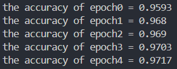

# 踏入深度学习的第一步

This project is highly inspired by TARIQ RASHID's book, namely *Make Your Own Nerual Network*

## 项目的目标

- 在此项目中，我们实现了一个```NerualNetwork```类，使其可以拥有创建出拥有任意的层数，宽度， 以及 sigmoid 激活函数等特性的神经网络模型，而这些特性仅依赖于```Numpy```以及```Scipy```两个较为底层的数学运算库。

- 在实现这些方法的过程中，可以掌握神经网络训练过程中的运算细节，尤其是反向传播机制，加深对神经网络模型的理解。

- 最后，我们的目标是将训练好的模型部署到一个嵌入式设备上，本人使用的是树莓派4B，并完成手写字识别的任务，最终识别的准确率在 96% 左右。

## 管中窥豹，可见一斑

对于一个简单的BP网络，算法的核心在于能够对一个任意深度和宽度的模型，实现正向传播和反向传播机制。为了实现这个目标需要两个可迭代容器，```self.weights```和```self.layers```。前者是我们训练的目标，即权重矩阵。后者中的每一个元素都是神经网络中的一层。

### 正向传播

```forward_prop()```函数表示了正向传播，假设第 $k$ 层 $\alpha^{(k)}$ 的宽度为 $m$，下一层 $\alpha^{(k+1)}$ 的宽度为 $n$，使用 $w_{ij}$ 表示该层第 $i$ 个节点与下一层的第 $j$ 个节点的链接。则如下矩阵表示了两层之间的权重矩阵：

$$
W =
\begin{pmatrix}
w_{11} & w_{21} & ... & w_{m1} \\
w_{12} & w_{22} & ... & w_{m2} \\
...    & ...    & ... & ...    \\
w_{1n} & w_{2n} & ... & w_{mn}
\end{pmatrix}
$$

将权重矩阵 $W$ 左乘 $\alpha^{(k)}$ ，需要注意的是此时该层的计算结果还不是真正的输出，或者说 $\alpha^{(k+1)}$ 的输入，需要将经过激活函数的处理才能得到下一层的输入。使用公式表示为：

$$
\alpha^{(k+1)} = sig(W\cdot\alpha^{(k)})
$$

这样```forward_prop()```的主要逻辑就很清晰了，```self.activate(weight.dot(temp))```就是上面的公式。由于每一轮训练并不需要上一个“世代”遗留下来的结果，所以在函数的开头会清空```self.layers```列表。一方面是节省了内存空间，另一方面也降低了出错的风险。

### 反向传播

反向传播是所有神经网络模型的精髓，同时也是难点。其思想的核心是如何将经过正向传播的误差向前传播，从而更新权重矩阵，使误差降低。因为神经网络模型的传播过程并不是线性的，每一轮的输出都经过了激活函数的"修正"，从而从后向前进行传播时，需要对激活函数进行逆函数运算，这并不容易实现。好在有**梯度下降**方法的存在，我们不用知道函数具体长什么样子，只需要知道沿着最陡峭的路线向下走，早晚能走到谷底。

假设输出层共有 $n$ 个节点，我们使用 $\sum_n(t_n - o_n(W))^2$ ，其中 $t_n$ 表示目标， $o_n(W)$ 表示输出层的输出，这是一个由权重矩阵决定的值。对其中的每一个分量计算偏导，因为我们使用的是 $sigmoid$ 函数，使用链式求导法则不难得到，其偏导数为：

$$
\frac{\partial }{\partial w_{ij}}\sum_n(t_n - o_n)^2 = -2(t_j-o_j)\cdot sig(\sum_i w_{ij} \cdot o_i) \cdot (1-sig(\sum_i w_{ij} \cdot o_i)) \cdot o_i
$$

又因为我们是沿着最陡峭的方向进行下降，从而权重矩阵的更新可以表示为：

$$
W_{new} = W_{old}
- 
lr 
\cdot
 \frac{\partial }{\partial w_{ij}}\sum_n(t_n - o_n)^2
$$

其中 $lr$ 表示学习率，也就是下山时每步要迈多大。将二者结合一下，得到：

$$
\Delta W = lr 
\cdot 
(\mathbf t_k - \mathbf o_k(W_{old}))^T 
\cdot
sig(\mathbf o_k) (1-sig(\mathbf o_k)） 
\cdot
\mathbf o_{k-1}^T
$$

在backward_prop函数中表示为:

```python {.line-numbers}
weight += self.lr * np.dot((error * self.layers[backwardIndex]) * (1.0 - self.layers[backwardIndex]), np.transpose(self.layers[backwardIndex - 1])) 
```

至此，我们的BP网络模型最核心的算法内容已经实现了。其余一些公式，例如```(np.asfarray(values[1:]) / 255.0 * 0.99) + 0.01```为归一化处理，```targets = np.zeros(self.Widths[-1]) + 0.01``` 以及 ```targets[int(values[0])] = 0.99```目的是避免出现 $sigmoid$ 函数无法取到的值等等，不再赘述。

## 别信广告，看看疗效

最后，我们写一个函数来评价一下模型的效果

```python

    def get_accuracy(self, testDataPath: str) -> float:
        scoreCard = []

        self.load_data(testDataPath)
        for data in self.inputs:
            values = data.split(',')
            label  = int(values[0])
            output = self.query(values[1:])
            answer = np.argmax(output)

            if (label == answer):
                scoreCard.append(1)
            else:
                scoreCard.append(0)
        scoreArray = np.asarray(scoreCard)
        return scoreArray.sum() / scoreArray.size

```
代码很容易理解，如果预测准确则在列表中插入1，反之则插入0。最后对整个列表求和，并除以列表的长度，得到该轮训练的准确率。

最后，我们使用了3层的神经网络，其中隐藏层有400个节点，对相同的数据集进行了5个世代的训练，最终模型的准确率可以达到$0.9717$。



使用这样一个简单的神经网络模型，就已经是可以达到一个不错的结果，至此，我们的模型部分就可以告一段落了。